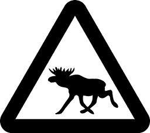
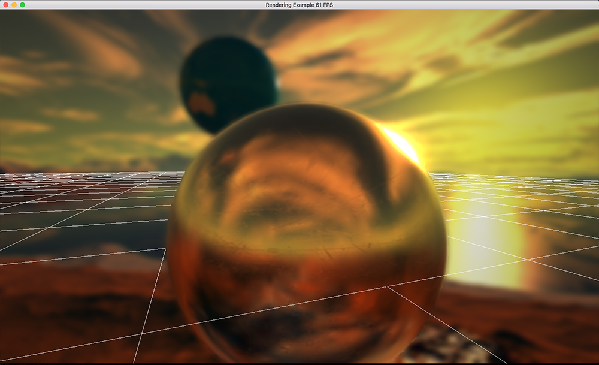

#Elk Engine

Graphics engine to control low level OpenGL interfacing used many of my OpenGL projects.

##Features
Support for both deferred rendering and forward rendering and costum renderables.
For deferred rendering I am using the "metalness" PBR workflow. Fresnel effect using Schlicks approximation for dielectrics, approximating metals by setting R0 to the albedo of the material. Some other shader effects are HDR-blooming and depth of field based on physical camera parameters.

Mesh loading using the assimp library.
Texture loading using freeimage.
Window management using GLFW.

##Build
The library and program are built using cmake.

Run CMake in the ElkEngine directory and build in ElkEngine/build.

### Dependencies
GLEW is required. Currently GLFW is the only supported window manager. To be able to load meshes, assimp needs to be linked and to be able to load textures, freeimage is required.

##Screenshots

Some screenshots of the PBR renderer.

PBR Materials from: http://freepbr.com
Cube maps from: http://www.humus.name/index.php?page=Textures
and: http://www.custommapmakers.org/skyboxes.php